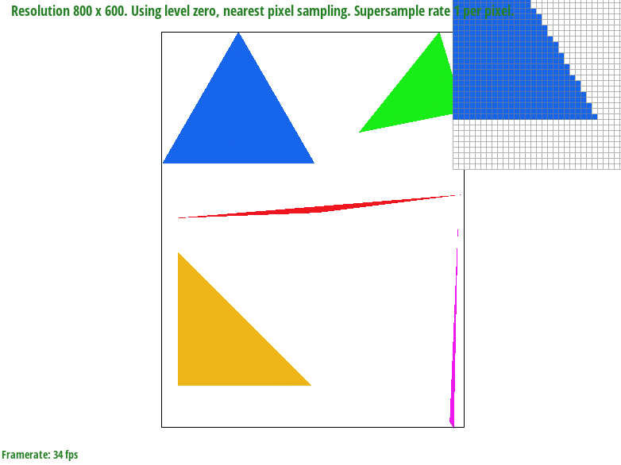
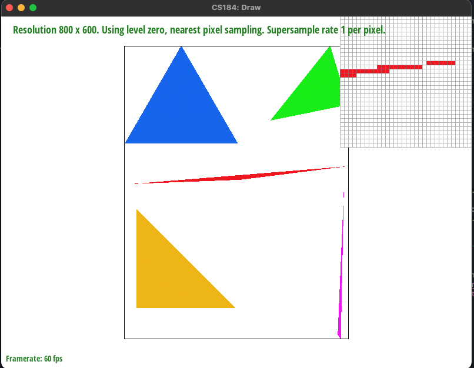
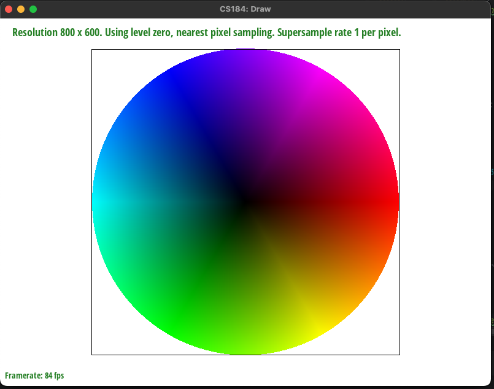
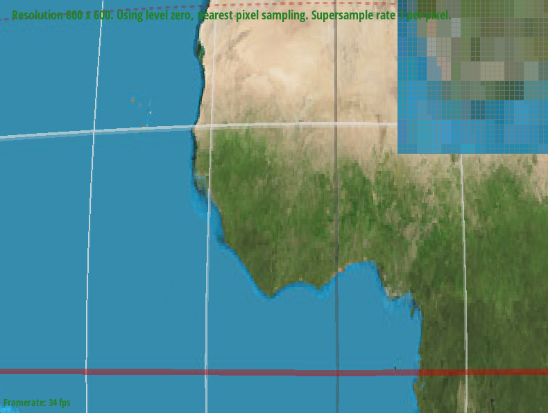
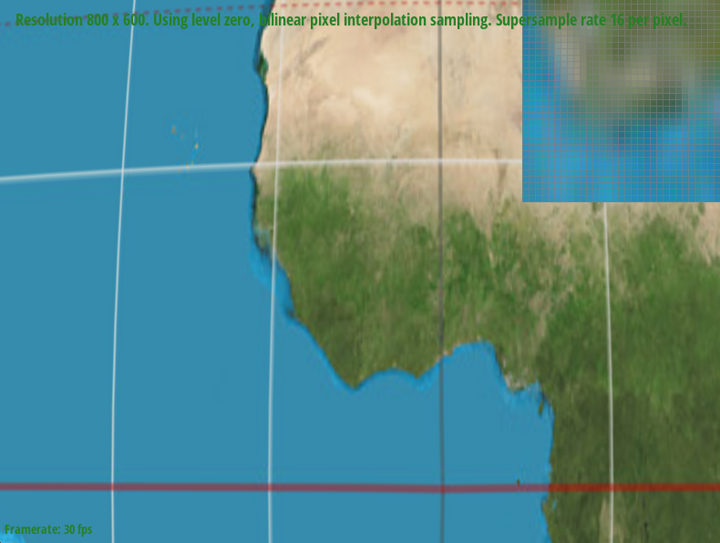
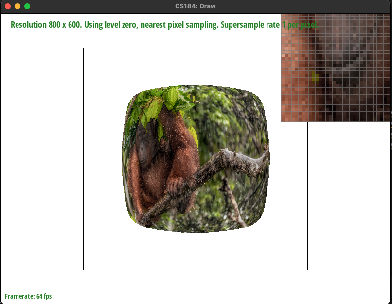
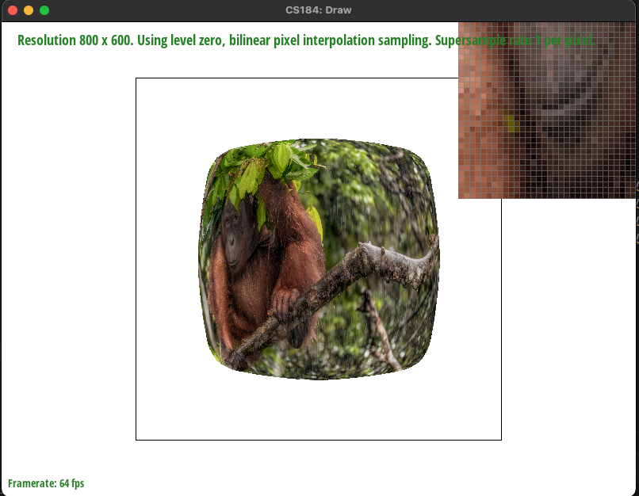
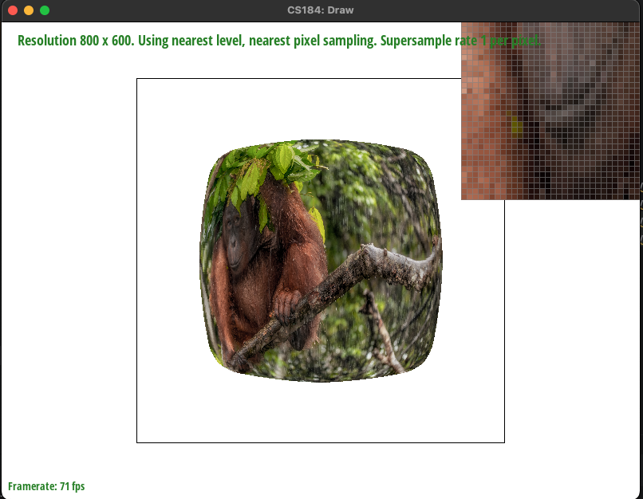

# Homework 1

## Overview

We implemented rasterizing of triangles with various sampling methods. It was interesting seeing how the
various techniques for improving render quality we learned in lectures worked out in practice.

## Task 1

To rasterize a triangle, we:
* Compute the triangle's bounding box For each pixel within the bounding box, check if the pixel is within the triangle (this involves 3 line tests).
* If the pixel is within the triangle, set the pixel's color to that of the triangle.

To calculate which side of a line a point `(x, y)` falls on, we compute

> `- (x - x0) * (y1 - y0) + (y - y0) * (x1 - x0)`

where `(x0, y0)` and `(x1, y1)` are two points on the line.

If the line test scores for each of the triangle's three edges are all nonnegative or all nonpositive,
the point `(x, y)` is inside the triangle. Note that this acccounts for both possible winding orders of the triangle.

Our algorithm checks each sample within the bounding box of the triangle. Note in particular that it does not
check one sample point for each frame in the frame buffer.

A screenshot of `basic/test4.svg` is shown below.

## Task 2

We essentially just updated the `sample_buffer` to contain the unrolled supersampled pixels.
We then stored the rasterized color of each supersampled pixel in `sample_buffer`, and later downsampled
via averaging in `resolve_to_framebuffer`. We had to modify several areas to match our unrolling scheme, which was
as follows:

> For a pixel at `(x, y, a, b)` where `x` is the x-coordinate, `y` is the y-coordinate, `a` is the supersampled x-coordinate
> within the pixel, and `b` is the supersampled y-coordinate within the pixel, the color is stored in 
> `sample_buffer[y * width * sample_rate + x * sample_rate + a * sqrt_sample_rate + b]`.

We also needed to update functions that changed the width, height, or sample rate to accordingly resize the sample buffer.

Supersampling is useful since it allows us to incorporate more information about the triangle into the limited number of pixels
in the framebuffer by sampling at more points.

Screenshots of `basic/test4.svg` are included below. These results are observed since pixels are no longer either fully inside or outside
the triangle, but rather can visually show pixels that are only partially inside of the triangle.

## Task 3

Here is a picture of cubeman waving while jumping:

## Task 4

Barycentric coordinates essentially interpolate linearly between the 3 vertices of a triangle. The 3 coordinates, alpha, beta, and gamma,
represent the weight of each vertex. The higher the coordinate, the closer the point is to the corresponding vertex of the triangle.
In the SVG below, the RGB value of each pixel represents its alpha-beta-gamma coordinate. It shows how, as we get closer to each vertex,
the pixels become closer to the color corresponding to that vertex. As we go between the vertices, we interpolate linearly between the colors.

A screenshot of `basic/test7.svg` is shown below.

## Task 5

Texture mapping allows us to associate additional information to vertices in the geometry
we are rendering.
For the purposes of this homework assignment, we implemented basic texture mapping for triangles.
Given the UV coordinates of each vertex of a triangle and its associated texture,
we must calculate the color of each pixel in the interior of the triangle.
We accomplish this by modifying our colored triangle rasterizer from task 4.

For each pixel that we find to be within the triangle, we compute the barycentric coordinates
of that pixel with respect to the three vertices of the triangle.
Using these barycentric coordinates, and the UV coordinates of the vertices,
we find an interpolated UV coordinate for the pixel we are currently rasterizing.
We then sample the texture at the interpolated UV coordinates, and draw the resulting color into our sample buffer.

We implemented two sampling methods:
* Nearest: in this method, we find the texture pixel nearest to a particular UV coordinate,
  and use the color of that texture pixel as the color of the triangle.
* Bilinear: in this method, we consider the four texture pixels that surround the UV coordinate we are considering.
  We then linearly interpolate among those four pixel colors.

Intuitively, bilinear sampling can smooth out sharp transitions in pixel color,
especially when a large part of screen space maps to a relatively small part of the texture space.
In these situations, nearest neighbor sampling would produce a sharp, visible edge when the sampler switches
from using one texture pixel to the next texture pixel.

Here are screenshots demonstrating the difference between the sampling methods.

Nearest sampling, 1 sample per pixel:

Bilinear sampling, 1 sample per pixel:

Nearest sampling, 16 samples per pixel:

Bilinear sampling, 16 samples per pixel:

We can see that bilinear sampling makes the image significantly smoother.
Supersampling does not help much here: when we zoom in on the texture, most or all
of the 16 samples of each pixel will map to the same texture pixel, and thus get the same color.
Increasing the supersampling ratio does not remove artifacts introduced by nearest sampling.

The difference between bilinear and nearest would be less noticeable if we were viewing a texture at a lower magnification.

## Task 6

Level sampling is sampling an existing downsampled lookup table called a mipmap for improved performance and to get an average of pixels
rather than just sampling a single pixel form a higher resolution texture map. We implemented it by first calculating the
difference vectors, then using them to decide which mipmap would be appropriate to sample from. We then sampled from the selected mipmap.

Using more samples per pixel increases memory usage and anti-aliasing power while decreasing speed. Using level sampling also decreases speed slightly
since we now need to calculate difference vectors. If mipmaps are stored in memory, level sampling increases memory usage since mipmaps must be stored. Level sampling
generally improves antialiasing power. Using nearest neighbor sampling is likely the fastest among the pixel sampling varieties, but has less antialiasing power than
bilinear sampling. It also has slightly less memory usage.

The desired screenshots are included below:

