# Homework 2

## Overview

We implemented algorithms for evaluating Bezier curves and manipulating meshes based on the halfedge data structure. It was interesting seeing how the mesh data structure
covered in class could be used to run a variety of useful mesh algorithms in constant time. Debugging meshes had a bit of a learning curve, but it was
fun to see the final working product.

## Part 1

We implemented de Casteljau's algorithm to evaluate points along Bezier curves.

Given N control points and a parameter t between 0 and 1, de Casteljau's algorithm
linearly interpolates (with parameter t) between each pair of consecutive points,
producing a new set of N-1 points.
This process is repeated on the set of N-1 points from the previous step,
yielding a set of N-2 points. We repeatedly perform interpolation until
only one point remains. This point is on the Bezier curve.

In pseudocode, one step of de Casteljau's algorithm looks like this:

```
evaluateStep(N, t, points):
    output = []
    for i = 0 to N-1
        output.append(lerp(points[i], points[i+1], t))
    return output
```

We created a Bezier curve with 6 control points, as shown below:

```
6
0.100 0.300   0.200 0.300   0.300 0.450   0.400 0.800   0.700 0.250     0.900 0.300     0.300 0.700
```

Here are screenshots of de Casteljau's algorithm at various steps for the curve with control points shown above.

The control points:

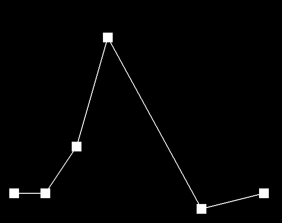

1 evaluation step:

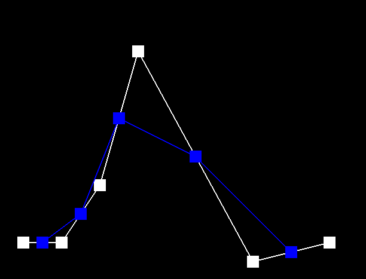

2 evaluation steps:

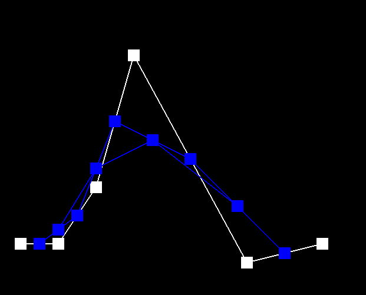

3 evaluation steps:

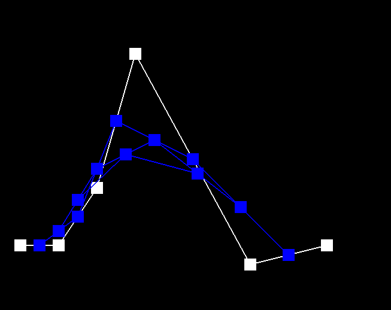

4 evaluation steps:

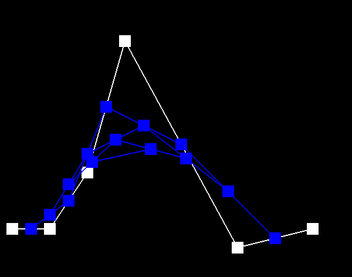

5 evaluation steps:

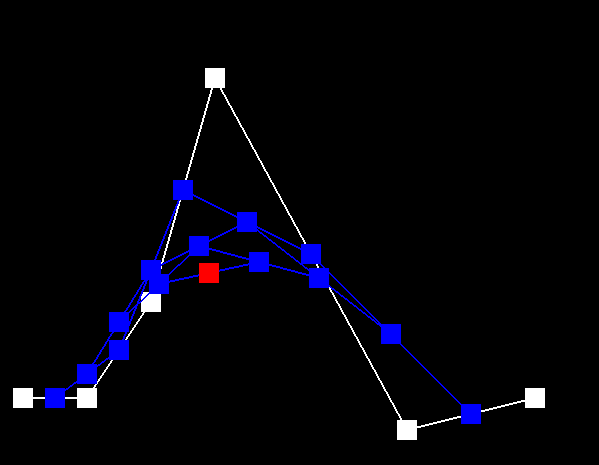

6 evaluation steps:

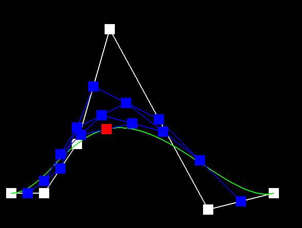

The final curve:

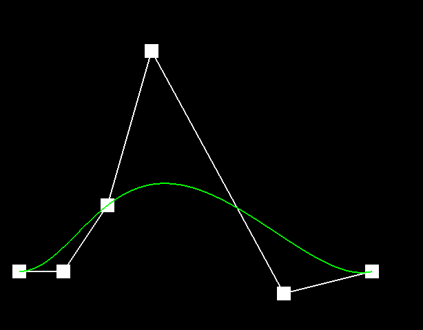

The final curve:


Here is another curve formed by moving the control points:

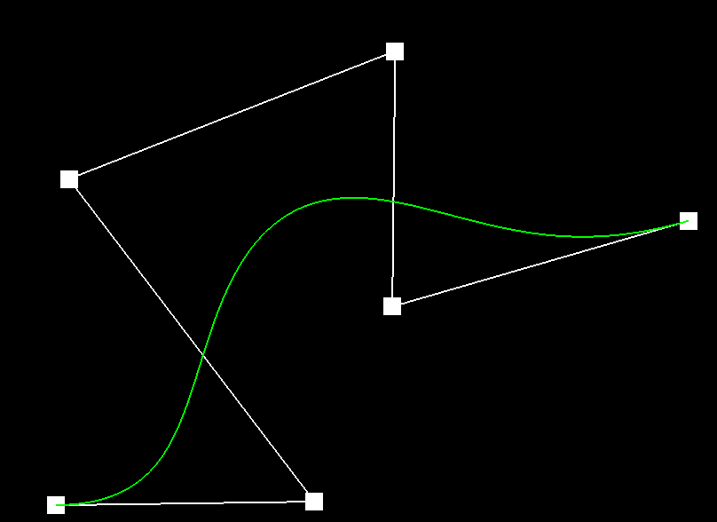

Here are the de Casteljau evaluation steps, with the t parameter modified:

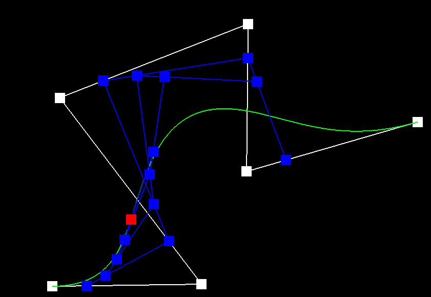

## Part 2

The de Casteljau algorithm can be extended from Bezier curves to Bezier surfaces.
To produce a Bezier surface, we start with an NxN grid of control points P(ij).
For a Bezier surface, there are two interpolation parameters: u and v.
Both independently range from 0 to 1.

The i'th row of control points is P(i*), where i identifies a row, and
we range over the second index. This row contains N control points.
We use de Casteljau's algorithm to interpolate across each row of control points,
using the u interpolation parameter. This produces a set of N new points, one per row.
We then perform another evaluation of de Casteljau's algorithm using this set
of N points, and the interpolation parameter v. This produces a point on the Bezier surface.

We can repeat this procedure for several u and v to build the full Bezier surface.

Here are screenshots of `bez/teapot.bez`:

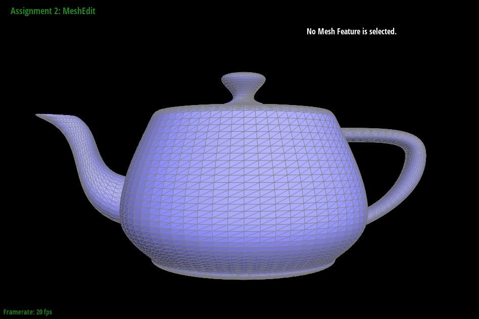

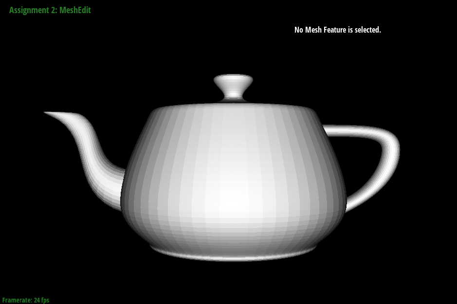

## Part 3

Using the provided code for iterating over neighboring vertices, we found the faces surrounding the given vertex.
We then took two vectors bordering the triangle and took their cross product, which automatically weights the vector by
the area of the face since the norm of the vector is twice the face area. We summed the cross products and divided by the norm
to get the final unit norm vector.


Here are screenshots of the teapot with and without vertex normals:

With:

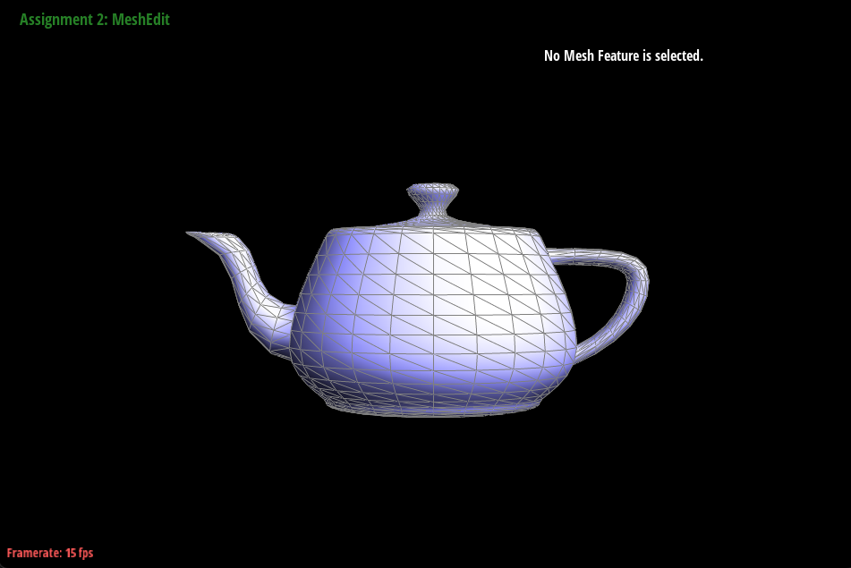

Without:

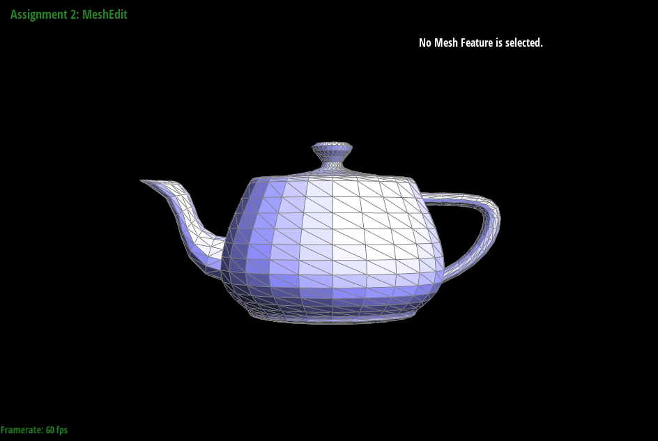

## Part 4

Consider the diagram shown below (taken from the HW2 spec):

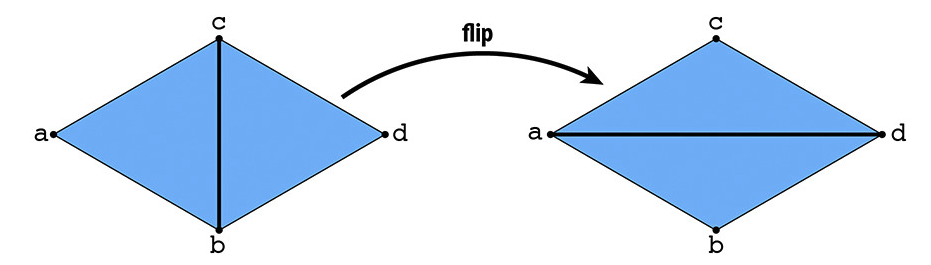

Our edge flipping implementation converts the b-c half edge in the original
geometry to be the d-a half edge in the final geometry.
Similarly, the c-b half edge becomes the a-d half edge.
We do this by modifying the vertex property of those half edges.

Here's a (non-exhaustive) list of other things we modified in the mesh geometry:
* The next pointer of a-b becomes b-d
* The next pointer of b-c becomes a-b
* The next pointer of c-b becomes d-c
* The next pointer of c-a becomes a-d (which is c-b in the original geometry)
* The next pointer of b-d becomes d-a (which is b-c in the original geometry)
* The next pointer of d-c becomes c-a
* Point c-a's vertex's halfedge to c-a
* Point b-d's vertex's halfedge to b-d
* Face abc becomes abd; set the halfedge of this face to a-b
* Face bdc becomes dca; set the halfedge of this face to d-c

After performing all these modifications, we return the halfedge that was originally c-b
(which is now a-d).

While we didn't necessarily use any interesting implementation or debugging tricks, we did:
* Use the `setNeighbors` function to ensure we were setting all pointers.
* Identify where segfaults occurred by printing to stdout and flushing stdout immediately.
  Without flushing, the program may exit before text appears in the terminal.

Some of the issues we encountered while debugging:
* Got segfaults when using `getHalfedge()`. Resolved by using `halfedge()` instead.
* Got segfaults when forgetting to set some of the pointers. Resolved by using `setNeighbors`
  to more conveniently set more pointers.
* Had missing faces after the flip. This was due to forgetting to set the halfedge pointer
  of faces. Once we set the pointer correctly, the issue was resolved.

Here are images of the teapot before and after flipping several edges (including flipping some edges twice).

Before:

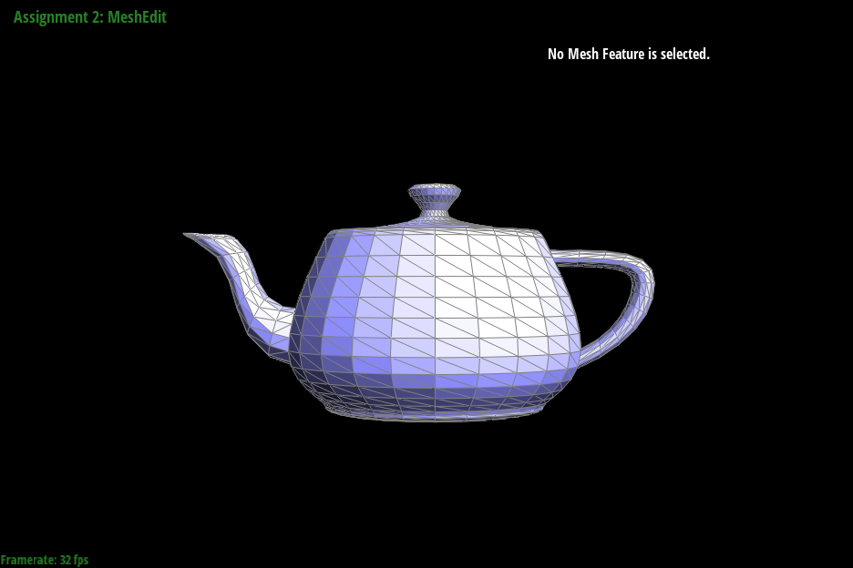

After:

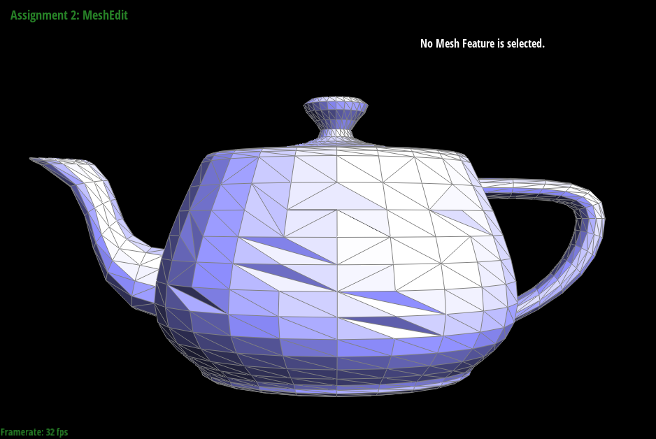

## Part 5

We essentially just created 2 new faces, 3 new edges, 1 new vertex, and 6 new halfedges, then connected them up according to the provided diagram.
It was tricky getting all of the pointers to point to the correct things, but using the GUI was very helpful when debugging. We were mostly able to 
carefully reason through our logic to solve our bugs.

Here are screenshots of doing edge split and edge flip operations on the cube mesh:


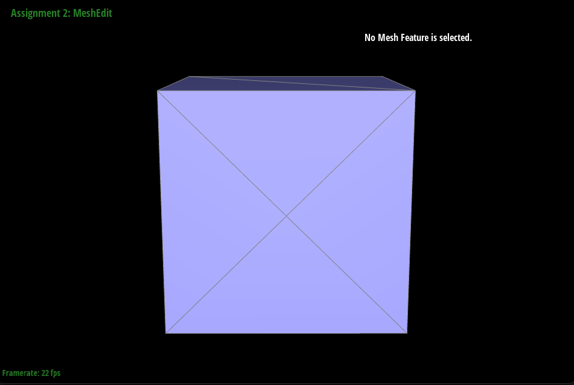
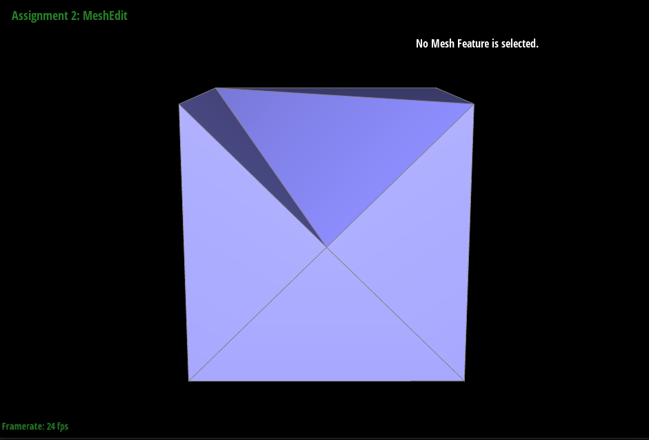
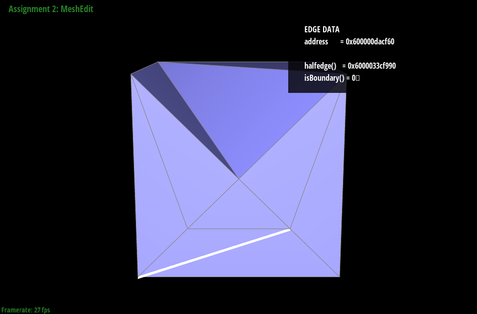
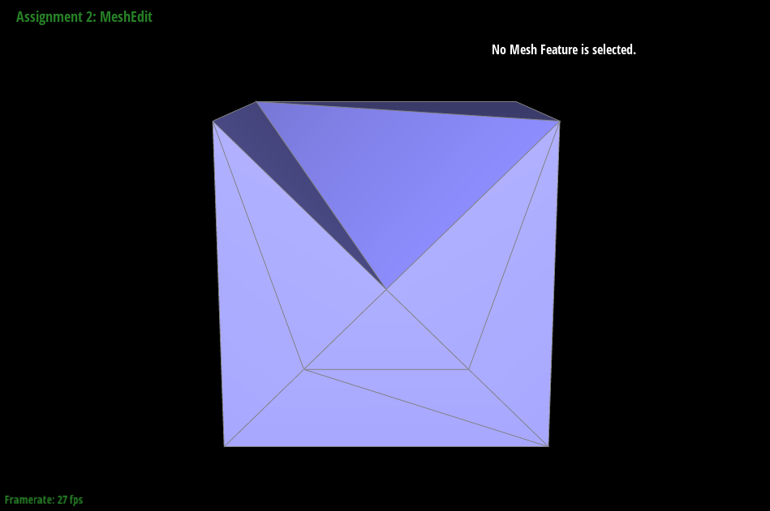

We had a lot of issues with forgetting to set some of our halfedge pointers. We had to add print statements throughout our code to narrow down
which pointers were set incorrectly, and clicked through the GUI to find weird looking numbers.

## Part 6

We essentially just followed the steps outlined in the comments. The main difficulty was marking the correct edges as new and distinguishing between
edges that needed to be flipped and those that didn't. We ended up needing to modify our `splitEdges` function to mark the edges that needed to be flipped as new,
in addition to marking the created vertex as new.

Here are some screenshots of subdivided meshes. The sharp corners and edges get smoothed out. By pre-splitting some edges, you can change the amount by which they are rounded off.

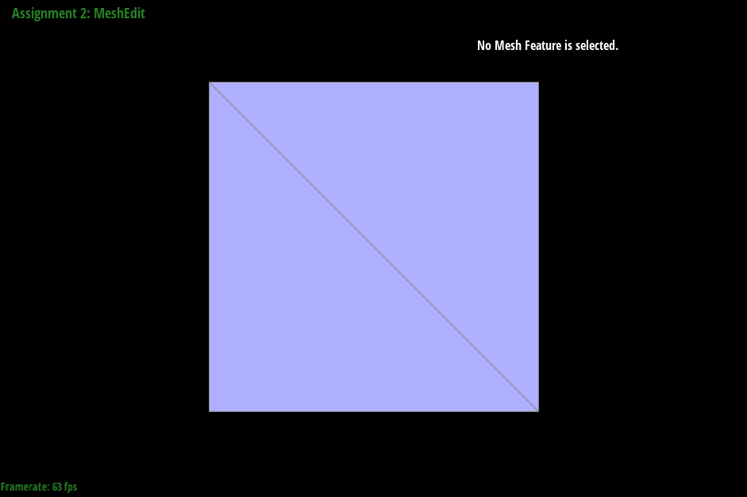
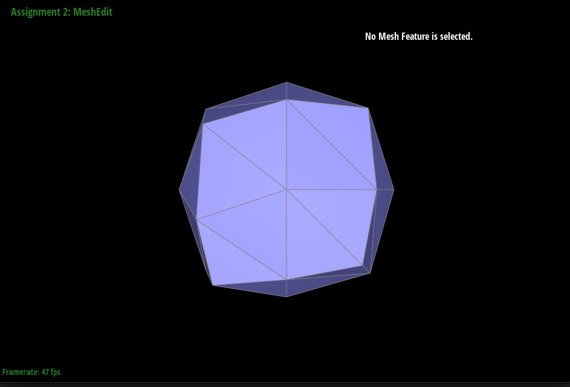
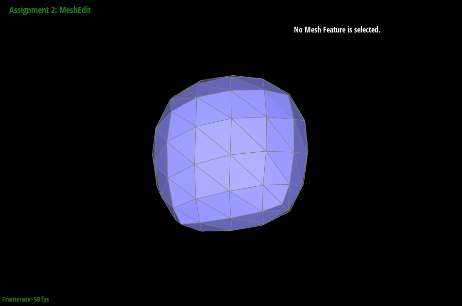

The asymmetry of the cube happens because the mesh is originally not symmetric, so vertices with higher degree remain sharper than other vertices in the cube. By preprocessing the mesh to be symmetric
with respect to the corners of the cube, we can make the subdivided mesh look a lot more symmetric. Here are some screenshots to illustrate how this works:

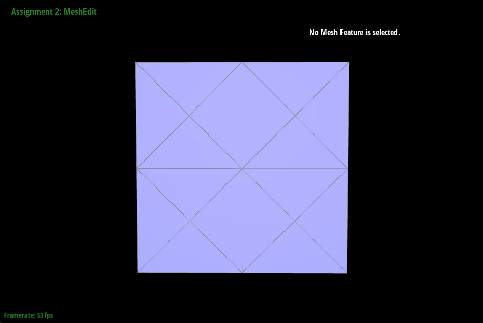

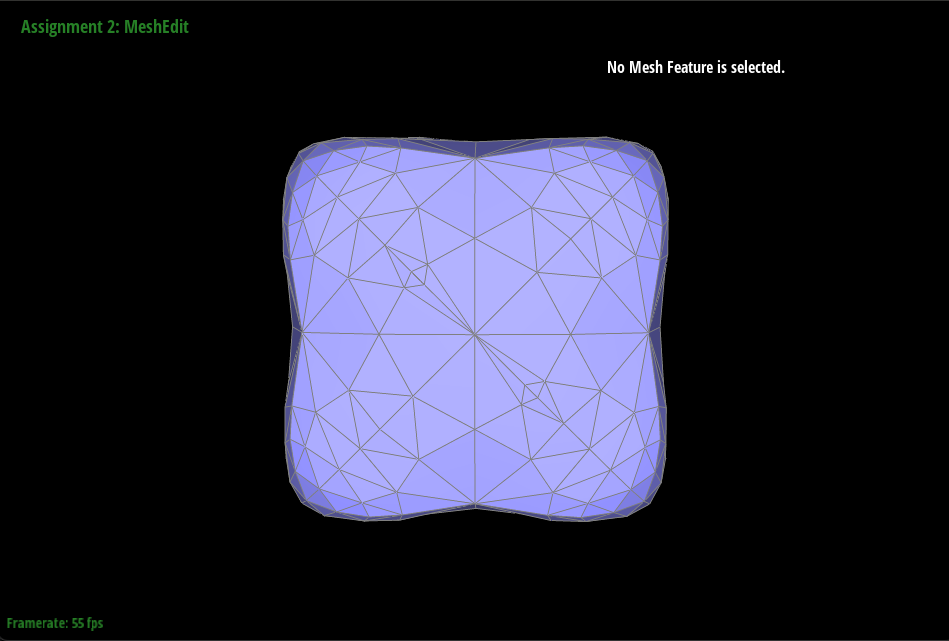
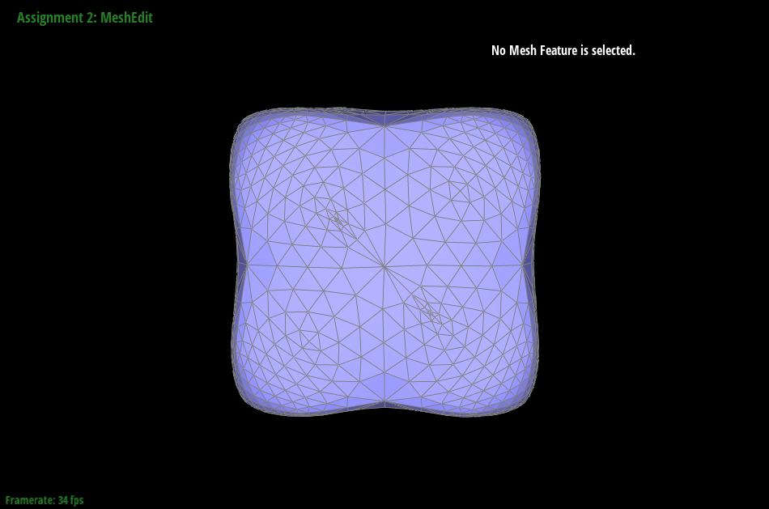

