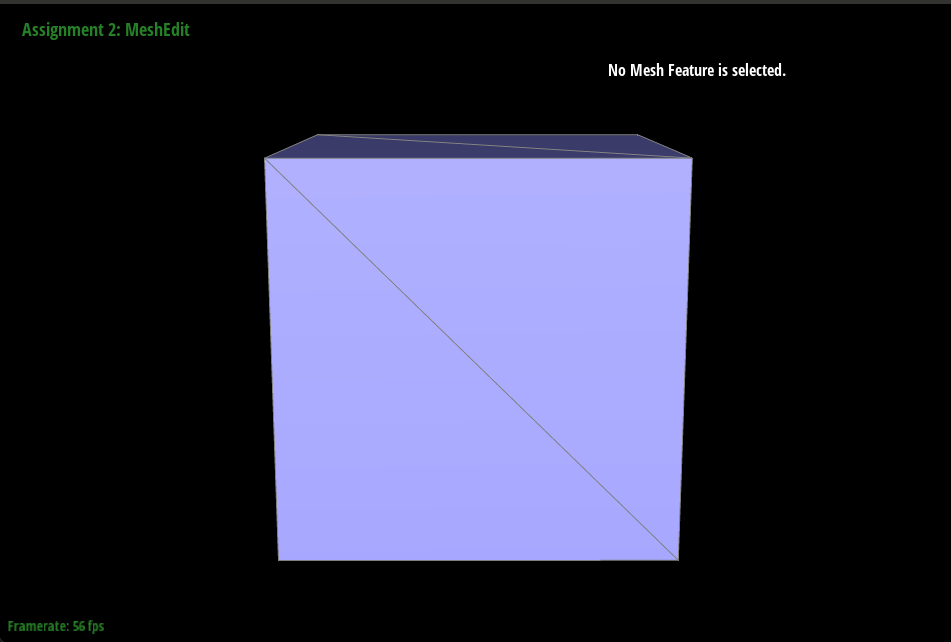
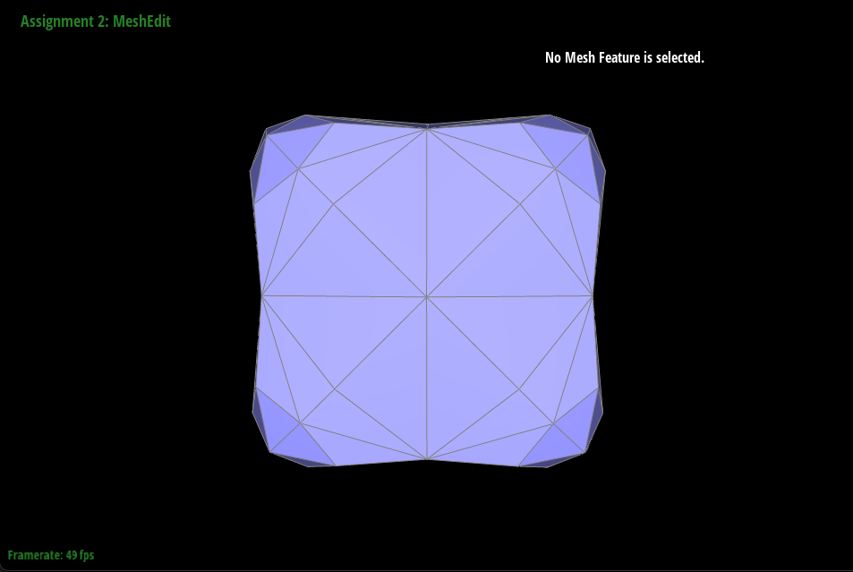

# Homework 2

## Overview

We implemented de Casteljau's algorithm to evaluate points along Bezier curves.

Given N control points and a parameter t between 0 and 1, de Casteljau's algorithm
linearly interpolates (with parameter t) between each pair of consecutive points,
producing a new set of N-1 points.
This process is repeated on the set of N-1 points from the previous step,
yielding a set of N-2 points. We repeatedly perform interpolation until
only one point remains. This point is on the Bezier curve.

In pseudocode, one step of de Casteljau's algorithm looks like this:

```
evaluateStep(N, t, points):
    output = []
    for i = 0 to N-1
        output.append(lerp(points[i], points[i+1], t))
    return output
```

We created a Bezier curve with 6 control points, as shown below:

```
6
0.100 0.300   0.200 0.300   0.300 0.450   0.400 0.800   0.700 0.250     0.900 0.300     0.300 0.700
```

Here are screenshots of de Casteljau's algorithm at various steps for the curve above.

## Part 3

Using the provided code for iterating over neighboring vertices, we found the faces surrounding the given vertex.
We then took two vectors bordering the triangle and took their cross product, which automatically weights the vector by
the area of the face since the norm of the vector is twice the face area. We summed the cross products and divided by the norm
to get the final unit norm vector.


Here are screenshots of the teapot with and without vertex normals:

With:


Without:


## Part 5

We essentially just created 2 new faces, 3 new edges, 1 new vertex, and 6 new halfedges, then connected them up according to the provided diagram.
It was tricky getting all of the pointers to point to the correct things, but using the GUI was very helpful when debugging. We were mostly able to 
carefully reason through our logic to solve our bugs.

Here are screenshots of doing edge split and edge flip operations on the cube mesh:




We had a lot of issues with forgetting to set some of our halfedge pointers. We had to add print statements throughout our code to narrow down
which pointers were set incorrectly, and clicked through the GUI to find weird looking numbers.

## Part 6

We essentially just followed the steps outlined in the comments. The main difficulty was marking the correct edges as new and distinguishing between
edges that needed to be flipped and those that didn't. We ended up needing to modify our `splitEdges` function to mark the edges that needed to be flipped as new,
in addition to marking the created vertex as new.

Here are some screenshots of subdivided meshes. The sharp corners and edges get smoothed out. By pre-splitting some edges, you can change the amount by which they are rounded off.


The asymmetry of the cube happens because the mesh is originally not symmetric, so vertices with higher degree remain sharper than other vertices in the cube. By preprocessing the mesh to be symmetric
with respect to the corners of the cube, we can make the subdivided mesh look a lot more symmetric. Here are some screenshots to illustrate how this works:





