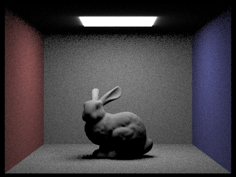
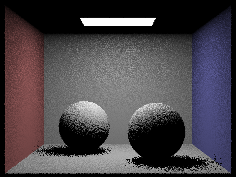
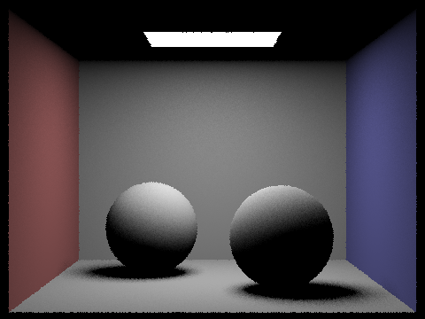
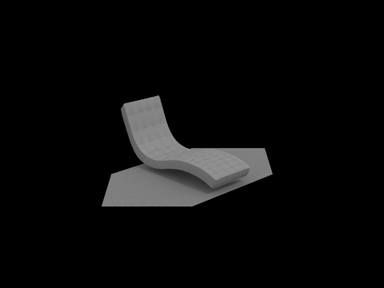
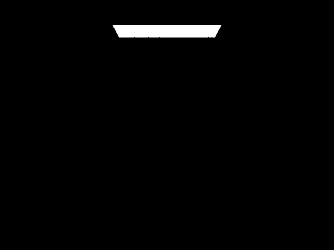
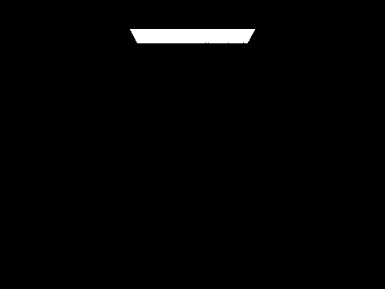

# Homework 3

## Overview

We implemented ray tracing algorithms and data structures for speeding up these algorithms. We also implemented lighting via
sampling. Many of the issues we ran into were related to normalizing quantities correctly and using vectors in the correct
coordinate frame. We were able to debug by reasoning through the possible causes of the errors seen in the render and finding
the relevant lines of code.

## Part 1

In this part, we randomly sampled rays within each pixel, converted them to world space,
and implemented ray-triangle and ray-sphere intersection.

### Ray Generation

Our goal is to render an image of size W x H.
We imagine that pixel `(x, y)` spans an axis-aligned unit square with corners `(x, y)`
and `(x+1, y+1)`.
To uniformly sample a random location within this pixel, we start by sampling from a unit square,
i.e. one with corners `(0, 0)` and `(1, 1)`. We then translate by `(x, y)` to obtain a location within
the desired pixel.

Next, we use the camera's position to translate the pixel location we sampled into
a ray in world coordinates.

To do this, we start by translating the pixel location into normalized image space: that is,
we treat the bottom left of the image frame as `(0, 0)`, and the top left as `(1, 1)`.
Doing this is simple: we just divide the pixel-space x coordinate by the image width (in pixels),
and the pixel-space y coordinate by the image height (in pixels).

We now convert the image space coordinates to a ray in camera space,
as shown in this figure from the HW spec:


If the normalized image space coordinate is `(x, y)`, the corresponding point
in camera space is `C = ( lerp(x, -tan(0.5 * hFov), tan(0.5 * hFov)), lerp(y, -tan(0.5 * vFov), tan(0.5 * vFov)), -1 )`.
The origin of the ray in camera space is always `(0, 0, 0)`. The direction of the ray is the vector `C`,
though we scale it to have unit norm.

Now that we have a ray in camera space, we can convert the ray to world space.
The origin of the ray translates to the camera position `pos`, and the direction of the ray
becomes `c2w * C` (normalized appropriately), where `c2w` is the camera to world transformation matrix of the camera.

We now have a ray in world space coordinates.

### Ray Intersection

#### Triangles

We used the Moller Trumbore algorithm to perform ray-triangle intersection.
The Moller Trumbore algorithm solves the following system of equations:

\\[ O + tD = (1 - b_1 - b_2) P_0 + b_1 P_1 + b_2 P_2 \\]

where $O$ is the origin of the ray, $D$ is the direction of the ray, and $P_0$, $P_1$, and $P_2$ are vertices of the triangle.
This is a system of 3 equations in 3 unknowns ($t, b_1, b_2$).
We can solve it analytically:

$$ t = \frac{S_2 \cdot E_2}{S_1 \cdot E_1} $$
$$ b_1 = \frac{S_1 \cdot S}{S_1 \cdot E_1} $$
$$ b_2 = \frac{S_2 \cdot D}{S_1 \cdot E_1} $$

where $E_1 = P_1 - P_0$, $E_2 = P_2 - P_0$, $S = O - P_0$, $S_1 = D \times E_2$, and $S_2 = S \times E_1$.

If $S_1 \cdot E_1 = 0$, $b_1 < 0$, $b_2 < 0$, or $1 - b_1 - b_2 < 0$, there is no intersection:
the ray either is parallel to the plane of the triangle, or intersects the plane of the triangle
outside the bounds of the triangle.

Conveniently, this algorithm gives us the barycentric coordinates of the intersection point
with respect to the vertices of the triangle. We use these to interpolate the surface normal vector
at the intersection point, given the normal vectors at each of the vertices.

#### Spheres

To perform ray-sphere intersection, we solve the following system of equations:

$$ P = O + t D$$
$$ (P - C) \cdot (P - C) = R^2 $$

where $O$ and $D$ are the origin and direction of the ray, respectively;
$P$ is the intersection point; $C$ is the center of the sphere; and $R$ is the radius of the sphere.
This system of equations is a quadratic in $t$, and can be written as

$$ a t^2 + bt + c = 0 $$
where $a = D \cdot D$, $b = 2 (O - C) \cdot d$, and $c = (O - C) \cdot (O - C) - R^2$.

We solve the quadratic using the quadratic formula

$$ t = \frac{-b \pm \sqrt{b^2 - 4ac}}{2a}.$$

We discard any solutions not within the minimum and maximum allowed `t` of the ray.

## Part 2

### BVH Construction

The BVH is constructed recursively. First, the bounding box of the current node is set to the union of the primitives' bounding boxes.
The `start` and `end` iterators are pointed to the start and end of the list of primitives.
If the number of nodes is smaller than `max_leaf_size`, then the node is returned immediately.

Otherwise, we find the average of the centroids of all of the primitive. We then split the primitives by centroid according to the axis
of the average centroid in which the current bounding box is the longest. If either the left or right sets are empty, we move one element
from the non-empty set to the empty one.

We then recursively construct the left and right nodes, point to them, and return the finalized node.

### Large DAE files

`sky/dragon.dae`


`meshedit/beast.dae`


`meshedit/maxplanck.dae`


### Rendering Time Comparison

For `meshedit/cow.dae`, the rendering time with BVH acceleration is 0.0460 seconds. Without BVH acceleration, the rendering time is 7.8535 seconds.
For `meshedit/teapot.dae`, the rendering time with BVH acceleration is 0.0450 seconds. Without BVH acceleration, the rendering time is 3.7334 seconds.
For `sky/CBbunny.dae`, the rendering time with BVH acceleration is 0.0327 seconds. Without BVH acceleration, the rendering time is 35.9606 seconds.
With BVH acceleration, rendering is significantly faster due to much fewer intersections being tested per ray.

## Part 3

In this part, we implement the diffuse BSDF, zero bounce illumination,
and direct illumination with both uniform hemisphere sampling and importance sampling.

### Uniform Hemisphere Sampling

In this method of sampling, we are given the intersection point of a camera ray
with an object in the scene. Our goal is to estimate how much light arrives
at that intersection point, so we can calculate how much will be reflected to the camera.
We will estimate the illumination, we will average a number of Monte Carlo samples drawn uniformly
from a unit hemisphere.

For each sample from the hemisphere, we will:
* cast a ray in the sampled direction
* determine if it intersects any objects in the scene
* if it does intersect an object, and that object is a light source,
  add the emission of the light source to our current estimate,
  scaled appropriately based on our material's BSDF, the angle of incidence,
  the number of samples, and the PDF (which is constant here due to uniform random sampling).

We must carefully track which calculations we do in object space and which calculations we do in
world space.

In more detailed pseudocode, our algorithm looks like this:

```
def estimate_l(curr_intersection):
    o2w, w2o = make_coordinate_space(curr_intersection.normal)
    L = (0, 0, 0)
    for i = 1 to numSamples:
      w_in = sample_hemisphere()
      costheta = dot(w_in, w2o * curr_intersection.normal)
      pdf = 1 / (2 * PI)
      ray = Ray(o=hit_point, d=o2w * w_in)
      hits, source_intersection = intersect(ray)
      if hits:
        L += source_intersection.object.emission * curr_intersection.bsdf.f(w_in, w_out) * costheta / (pdf * numSamples)
```

### Importance Sampling

The procedure for importance sampling is very similar to the procedure described above,
except that instead of sampling `w_in` uniformly over the hemisphere, we sample
`w_in` over the space of rays that point towards a light source.
We perform a configurable number of samples for each area light,
and 1 sample for each point light.

Instead of using a constant PDF of $\frac{1}{2\pi}$, we use the PDF from
sampling over the area of the light.

### Images

Here are some images that depict the properties of the uniform hemisphere sampling
and the light source importance sampling algorithms.
The images below were rendered with 64 samples per pixel and 16 light rays.

CBbunny, hemisphere sampling:



CBbunny, importance sampling:


CBspheres (Lambertian), hemisphere sampling:


CBspheres (Lambertian), importance sampling:


Here is the `CBspheres_lambertian` scene with various number of light rays
and one sample per pixel with light-based importance sampling.

$l=1$:



$l=4$:


$l=16$:


$l=64$:



TODO: Compare the results between uniform hemisphere sampling and lighting sampling in a one-paragraph analysis.

## Part 4

### Indirect Lighting Function

First, if we are accumulating bounces or the depth of the ray is one less than the max ray depth, we compute the one bounce radiance by calling `one_bounce_radiance`
and add it to `L_out`. We then sample an input vector from the BSDF of the current intersection and use that to find the next intersection of interest. If
the new vector intersects the scene, we recurse by calling `at_least_once_bounce_radiance` and adding the result to `L_out`.

### Images with Global Illumination




### Direct and Indirect Illumination Comparison

### `m`th Bounce Renders

Here are renderings of CBbunny with accumulated bounces disabled and 1024 samples per pixel.

$m=0$:



$m=1$:


$m=2$:


$m=3$:


$m=4$:


$m=5$:


The 2nd bounce of light seems to be lighting the underside of the bunny, while the 3rd bounce seems to mostly have illumination along the walls of the scene.
These contribute to the quality of the image by lessening the darkness of the shadows, making the rabbit seem more realistic rather than having very dark portions
away from the light.

###  `max_ray_depth` Renders

Here are renderings of CBbunny with accumulated bounces (limited by max ray depth)
and 1024 samples per pixel.

$m=0$:



$m=1$:


$m=2$:


$m=3$:


$m=4$:


$m=5$:


### Russian Roulette Renders

$m=0$:


$m=1$:


$m=2$:


$m=3$:


$m=4$:


$m=100$:


### Sample-per-pixel Renders

1 sample-per-pixel


2 samples-per-pixel


4 samples-per-pixel


8 samples-per-pixel


16 samples-per-pixel


64 samples-per-pixel


1024 samples-per-pixel


The higher the samples-per-pixel, the less noisy the scene becomes.

## Part 5

### Adaptive Sampling

Adaptive sampling essentially samples pixels until they converge, allowing us to spend fewer samples on pixels that converge faster and more samples on pixels that converge slower.
To implement adaptive sampling, we modified `PathTracer::raytrace_pixel` to keep running `s1` and `s2` sums as we sample. Every `samplesPerBatch` samples, we compute `mu` and `sigma` from
`s1` and `s2`, then use the provided criteria to decide if we should break from the sampling loop. Once we break from the loop, we normalize the pixel value by the actual number of samples
(which may be less that the provided number of samples if the pixel converged earlier).

### Images

`sky/CBspheres_lambertian.dae`


`sky/CBbunny.dae`


## Collaboration

We divided up the parts and worked on them in parallel, then came back together to integrate our changes. Rahul worked on parts 1, 3, and 4, and Rohan worked on parts 2, 3, and 5.
The homework went relatively smoothly, with a couple bugs with our BVH implementation that took renders to take a lot longer than they should have. We learned a lot about how ray-tracing works
and the practical considerations when creating a ray tracing algorithm that is feasible for a large number of primitives.
