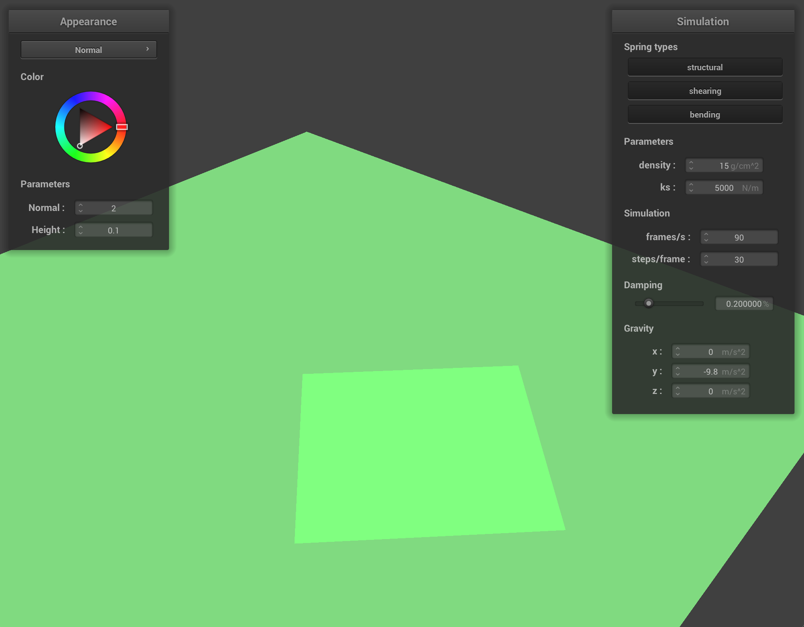
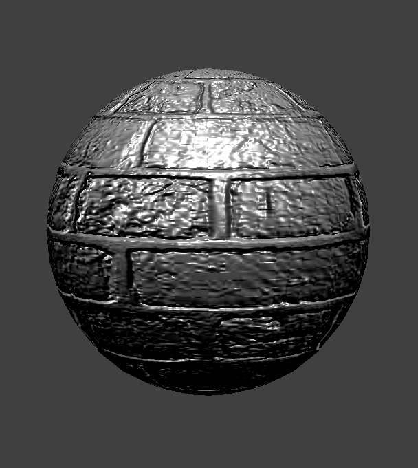

# Homework 4

## Overview

We implemented cloth simulation using point masses and springs. We added support for forces like gravity and intersection with collision objects.

## Part 1

Some screenshots of the wireframe:

Without shearing constraints:

Shearing constraints only:

All constraints:

## Part 3

### Sphere

`ks = 5000`

`ks = 500`

`ks = 50000`

For higher `ks` values, the cloth becomes more stiff, causing it to have less folds and conform less to the shape of the sphere.

### Plane

## Part 5

### Shaders

Shaders are programs that compute a single color based on a given vertex and other relevant parameters. Having a specific API allows these shaders to run quickly and in parallel.
Vertex shaders operate on the geometric properties of vertices and provide necessary data to fragment shaders. Fragment shaders use the geometric properties from the vertex shader
to compute the color of a fragment of the scene.

### Blinn-Phong shading

The Blinn-Phong shading model incorporates ambient (a constant contribution from the environment), diffuse (uniformly in all direction), and specular (brighter at the reflection angle) components to compute the color of a fragment.

Ambient only:

Diffuse only:

Specular only:

All:

### Texture mapping

### Displacement and bump mapping

Sphere with bump mapping:

Cloth with bump mapping:

Sphere with displacement mapping:

Sphere with bump mapping (coarseness `16`):

Sphere with displacement mapping (coarseness `16`):

Sphere with bump mapping (coarseness `128`):

Sphere with displacement mapping (coarseness `128`):

### Mirror shader

