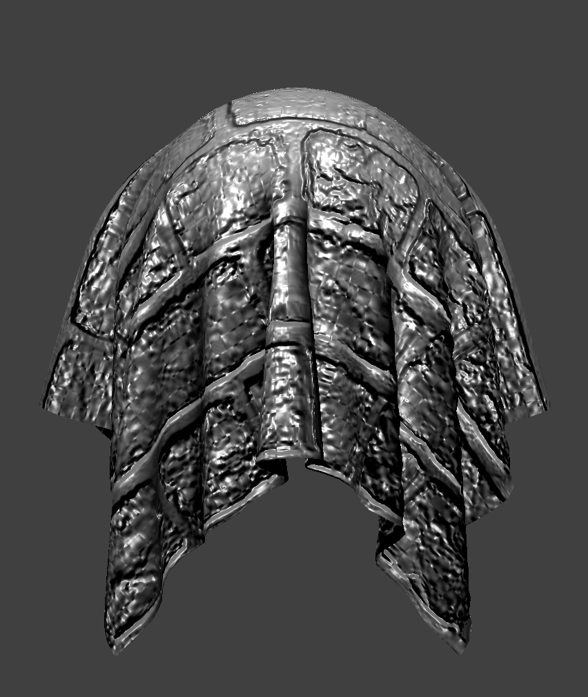

# Homework 4

## Overview

We implemented cloth simulation, treating the cloth as a collection of point masses and springs,
and Verlet integration to update the positions of the masses over time.
We added support for forces like gravity and intersection with collision objects.
Finally, we implemented various shaders to give our cloth color and texture.

## Part 1

Some screenshots of the wireframe:

![](images/p1_full_mesh.png]
![](images/p1_zoomed_mesh.png]

Without shearing constraints:
![](images/p1_wo_shearing.png]

Shearing constraints only:
![](images/p1_shearing_only.png]

All constraints:
![](images/p1_all.png]

## Part 2

In the subparts below, all parameters were set to their defaults
except for the parameter being investigated.

### Spring Constant

With a low `ks`, the cloth has more fine-grained wrinkles, and it sags more in its final state.
With a high `ks`, the cloth better retains its rectangular shape: it sags less, and has few wrinkles.
Here's a visual comparison:

`ks = 100 N/m`:

![](images/p2_ks_100.png]

`ks = 50000 N/m`:

![](images/p2_ks_50k.png]

### Density

With a low density, the cloth sags less in its final state and has fewer wrinkles.
It also looks "airy" as it falls slowly.
With a high density, the opposite is true: the cloth sags more and has more wrinkles,
and doesn't quite have the same illusion of falling slowly.

A visual comparison of the final states:

`density = 1 g/cm2`

![](images/p2_density_1.png]

`density = 100 g/cm2`

![](images/p2_density_100.png]

### Damping

With a high damping, the cloth moves/falls very slowly.
With a low damping, the cloth flutters wildly as it falls,
and it takes longer to converge to its resting state.
For 0 damping, the cloth may not ever converge.

Here is a comparison of the cloth as it is falling.

Damping = 1%

![](images/p2_high_damping.png]

Damping = 0%

![](images/p2_low_damping.png]

### Final State

Here is an image of the cloth from `pinned4` in its final state.
All parameters were set at their default values.

![](images/p2_default_pinned4.png]

## Part 3

`ks = 5000`
![](images/p3_5000.png]

`ks = 500`
![](images/p3_500.png]

`ks = 50000`
![](images/p3_50000.png]

For higher `ks` values, the cloth becomes more stiff, causing it to have less folds and conform less to the shape of the sphere.

## Part 4

Here are a few images of the falling cloth. All parameters are set to the default values.

, and specular (brighter at the reflection angle) components to compute the color of a fragment.

Ambient only:

Diffuse only:

Specular only:

All:

### Texture mapping

### Displacement and bump mapping

Sphere with bump mapping:

Cloth with bump mapping:

Sphere with displacement mapping:

Sphere with bump mapping (coarseness `16`):

Sphere with displacement mapping (coarseness `16`):

Sphere with bump mapping (coarseness `128`):

Sphere with displacement mapping (coarseness `128`):

### Mirror shader

